# Coins counter

Video demo:  
https://youtu.be/b6b5q4yu3_E  

Simple coins counter for arcade games.    
It emulates keyboard. On coin dropped sends short `c` key press. On press start button on the top sends `Enter (return)` key press  

Coins counter module datasheet:   
[link](ins_40-1500-05.pdf)  

Assembled:
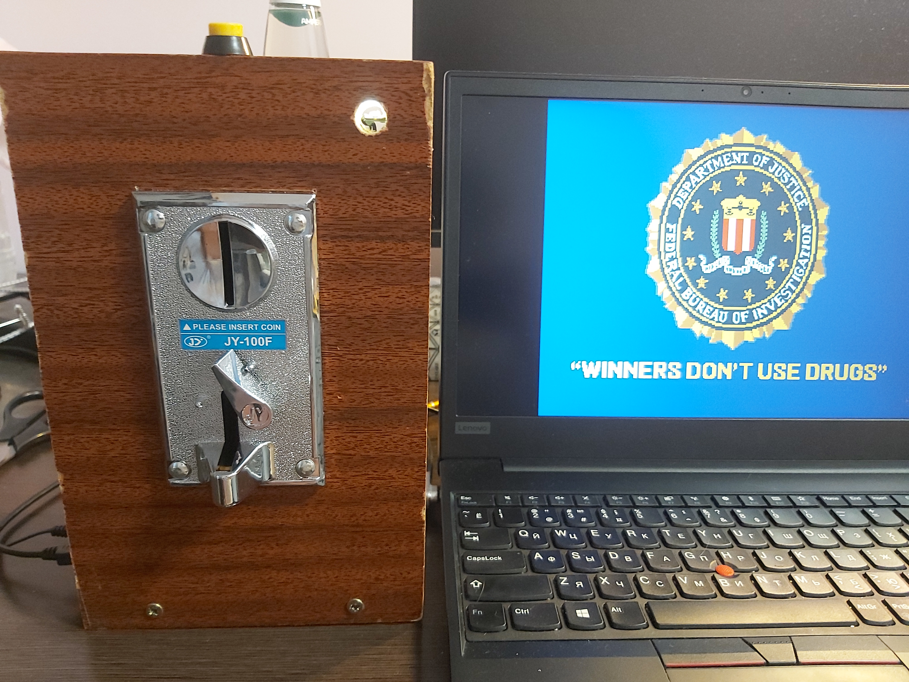    
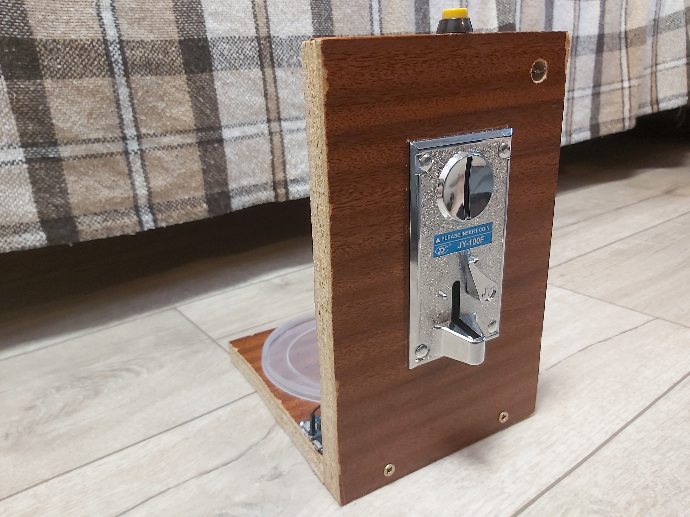    
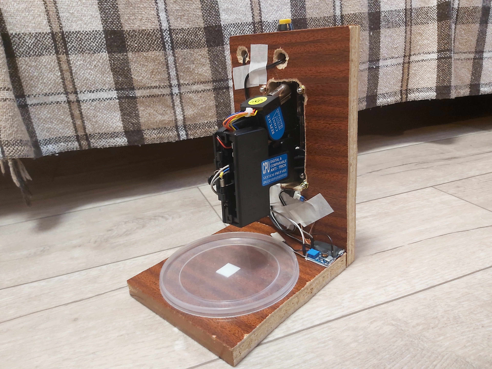    
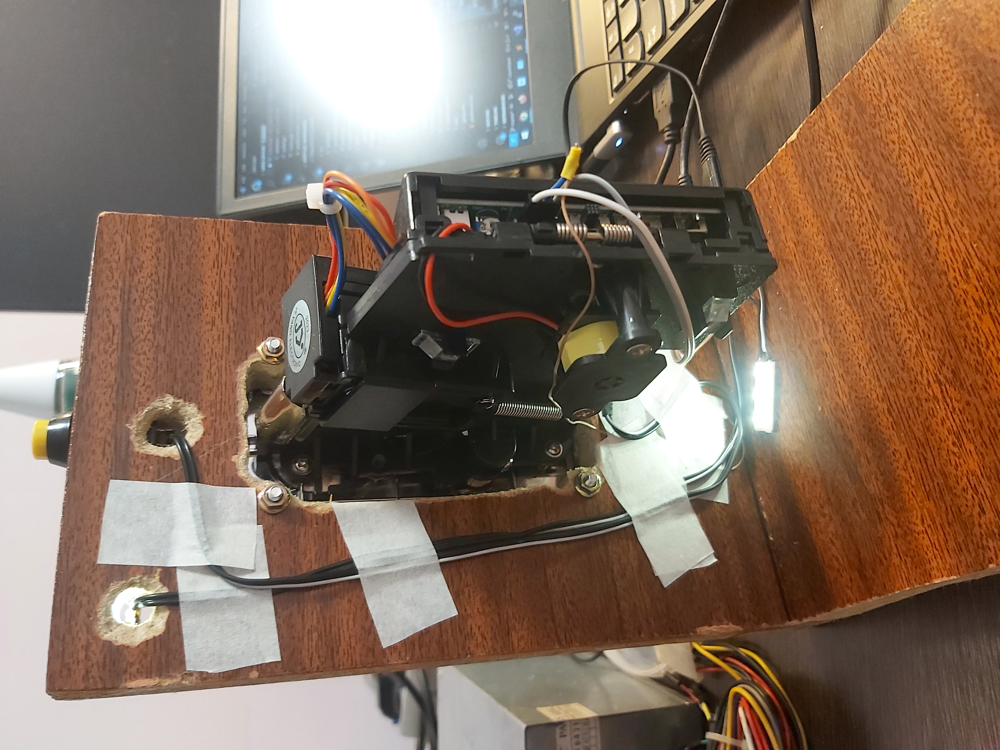    

Within "arcade cabinet":  
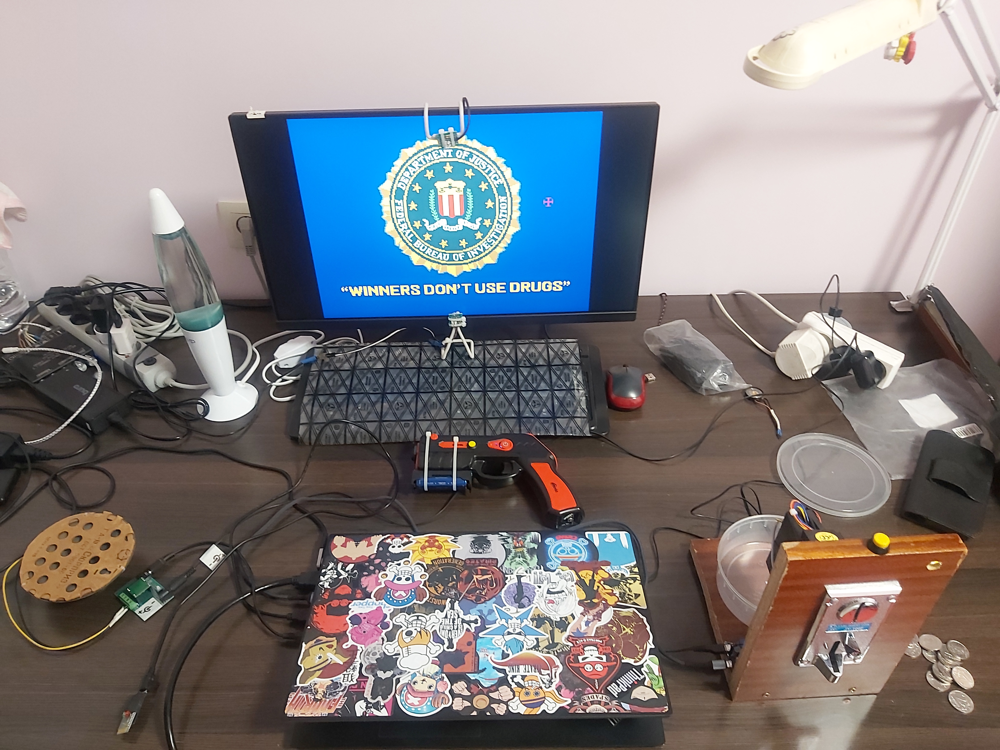    
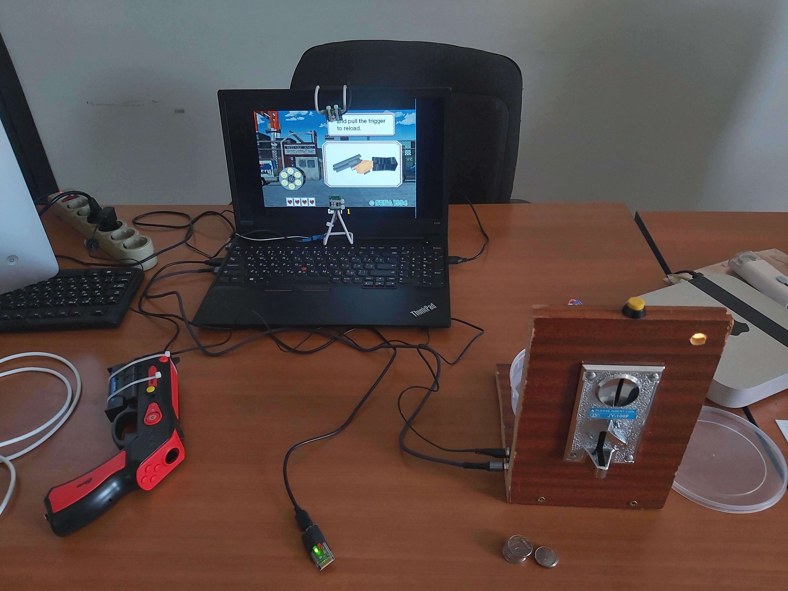  

Video demo with light gun:  
https://youtu.be/HeBRopewjwI  

## Making of

Coins counter module unboxing:  
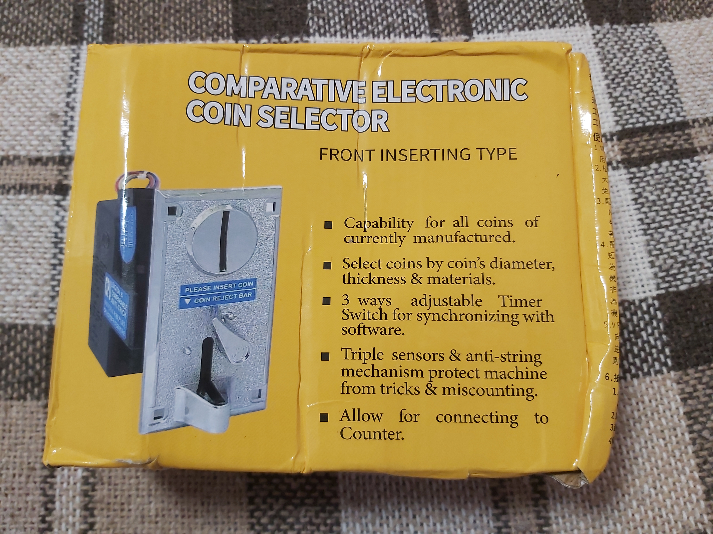  
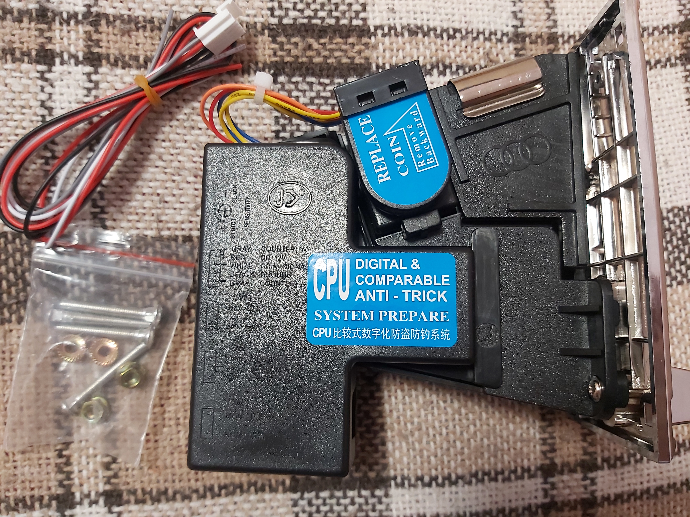  

Coins counter module testing:  
https://youtu.be/GgQ5F4qQySQ  

Paper template for hole:  
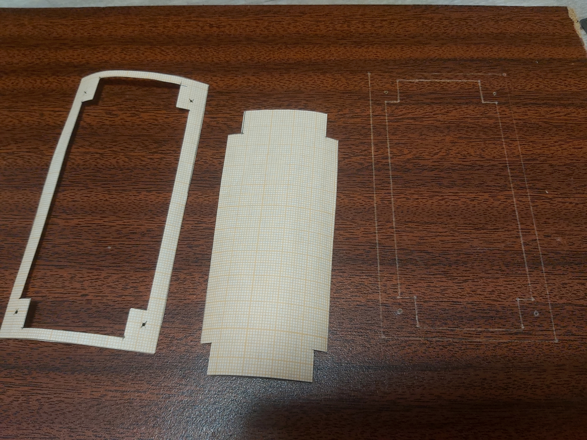    

Made hole:  
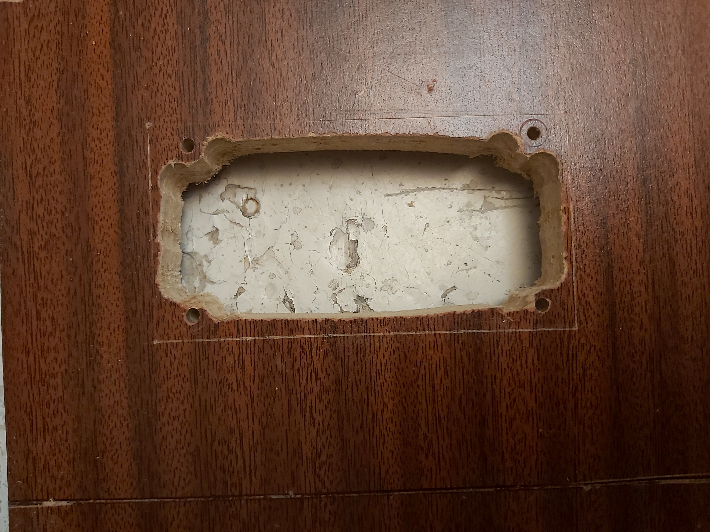    

Before assembling:  
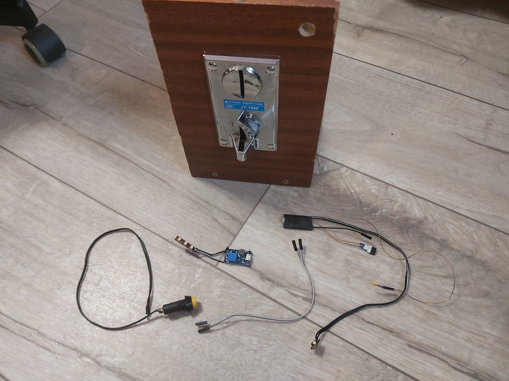    
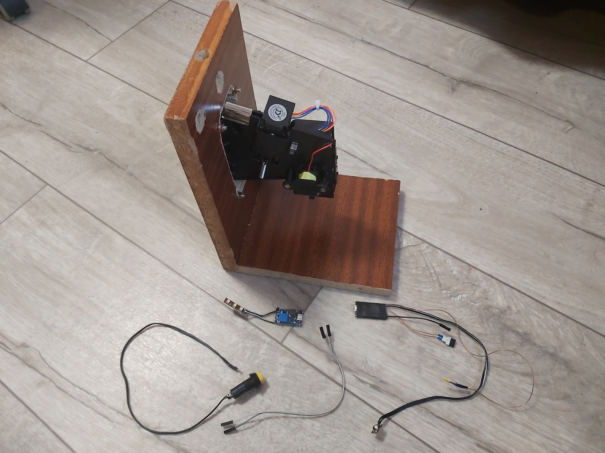    
